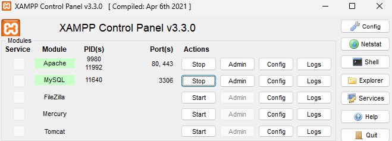

<p align="center"><a href="https://laravel.com" target="_blank"></a></p>

<p align="center">
<a href="https://github.com/laravel/framework/actions"></a>
<a href="https://packagist.org/packages/laravel/framework"></a>
<a href="https://packagist.org/packages/laravel/framework"></a>
<a href="https://packagist.org/packages/laravel/framework"></a>
</p>


## 🚀 Tecnologias e Padrões
* **Framework:** Laravel 11
* **Linguagem:** PHP 8.2+
* **Frontend:** Tailwind CSS & Blade
* **Arquitetura:** * **Service Layer:** Lógica de negócio desacoplada dos Controllers.
* **Policies:** Controle de permissões (apenas o autor edita/deleta sua postagem).
* **Migrations & Seeders:** Banco de dados estruturado e pronto para teste.


## 🛠️ Como Executar o Projeto


1. **Instale o Xampp:**
https://www.apachefriends.org/pt_br/index.html


2. **Clica em 'start' no Apache e MySQL**



3. **Clone o repositório:**
    Abra o terminal e execute:

   ```bash
   git clone [https://github.com/01Vitorhugo/Noweb-Teste.git](https://github.com/01Vitorhugo/Noweb-Teste.git)
   cd Noweb-Teste


4. **Instale as dependências:**
    Instale os pacotes do PHP e compile os assets do Frontend:

    # Dependências do Laravel
    composer install

    # Dependências de Estilização (Tailwind CSS)
    npm install && npm run build


5. **Configure o Ambiente:**
    Crie o arquivo de configuração e gere a chave de segurança:

    # Copia o arquivo de exemplo
    cp .env.example .env

    # Gere a chave da aplicação
    php artisan key:generate 

    Cole a chave no seu arquivo .env (APP_KEY=)


6. **Prepare o Banco de Dados:**
    Crie as tabelas e popule-as com os dados de teste (usuários e categorias):

    php artisan migrate:fresh --seed


7. **Inicie o servidor:**
    Com tudo configurado, suba o servidor local:

    php artisan serve

    Acesse em seu navegador: http://localhost:8000


